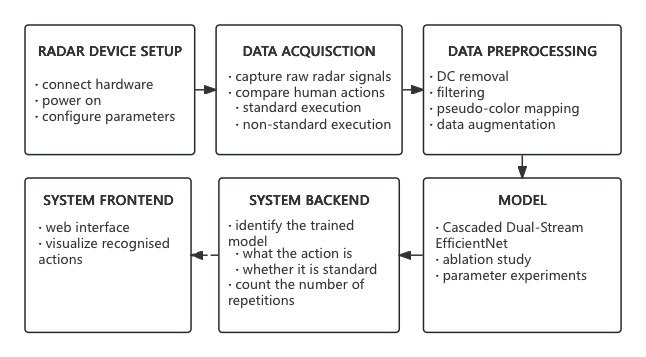

# Intelligent Sports Action Detection System

> **Overview**  
> This is a deep learning-based system for detecting and classifying key actions in sports videos. It supports both offline training and real-time inference, offering high precision and deployment flexibility.

---

## 📑 Table of Contents
1. [Background](#background)
2. [Features](#features)
3. [Architecture](#architecture)
4. [Quick Start](#quick-start)
   - [Environment Setup](#environment-setup)
   - [Installation](#installation)
   - [Data Preparation](#data-preparation)
   - [Training](#training)
   - [Inference / Demo](#inference--demo)
5. [Project Structure](#project-structure)
6. [Configuration](#configuration)
7. [Dataset & Metrics](#dataset--metrics)
8. [FAQ](#faq)
9. [Contributing](#contributing)
10. [License](#license)
11. [Acknowledgements](#acknowledgements)

---

## Background
- **Motivation**: Sports videos are large in scale, and manually identifying actions (e.g., goals, dunks) is time-consuming.
- **Goal**: Provide an end-to-end solution that enables automated **frame sampling → action classification → temporal localization** with high accuracy and deployability.

---

## Features
| Module             | Description                                                                 |
| ------------------| ---------------------------------------------------------------------------- |
| **Action Classes** | Supports multiple sports actions (e.g. dunk, goal, block, serve); easy to extend |
| **Temporal Detection** | Outputs action segments with `start_time - end_time`                      |
| **Multi-modal Input** | Optional support for optical flow and keypoint inputs                      |
| **Real-Time Inference** | Optimized for real-time processing on GPU (e.g., RTX <...>)              |
| **Trainable**      | Supports single/multi-GPU training with resume support and built-in logging |
| **Deployment Ready** | Export to ONNX / TensorRT / TorchScript; Docker support included           |

---

## 🧠 Architecture

The system consists of six major components that handle radar input, processing, modeling, and result display.



---

## Quick Start

### Environment Setup

* **Python** ≥ 3.9
* **PyTorch** ≥ 2.1 (CUDA 11.8+ recommended)
* Additional dependencies listed in `requirements.txt`

### Installation

```bash
# 1. Clone the repository
git clone https://github.com/Cjj040721/intelligent-sports-action-detection.git
cd intelligent-sports-action-detection

# 2. (Optional) Create virtual environment
conda create -n sports_action python=3.9 -y
conda activate sports_action

# 3. Install dependencies
pip install -r requirements.txt
```

### Data Preparation

1. Place video files in `data/raw_videos/`
2. Place annotations in `data/annotations/` (COCO, CSV, or ActivityNet format)
3. Run preprocessing:

   ```bash
   python tools/prepare_data.py --config configs/data/prepare.yaml
   ```

### Training

```bash
# Single GPU
python tools/train.py --config configs/train/base.yaml

# Multi-GPU (DDP)
torchrun --nproc_per_node 4 tools/train.py --config configs/train/base.yaml
```

### Inference / Demo

```bash
python tools/infer.py --video examples/basketball_dunk.mp4 --checkpoint checkpoints/best.pt
# or run the web demo
streamlit run webui/app.py
```

---

## Project Structure

```text
.
├── configs/               # Configuration files
│   ├── data/
│   └── train/
├── data/                  # Raw and processed data
├── docs/                  # Technical docs and papers
├── models/                # Model architectures
├── notebooks/             # Jupyter notebooks
├── tools/                 # Utility scripts
├── webui/                 # Streamlit frontend
├── tests/                 # Unit tests
├── Dockerfile
└── README.md
```

---

## Configuration

| Key Field        | Description                       | Example        |
| ---------------- | --------------------------------- | -------------- |
| `model.backbone` | Backbone network (3D CNN, ViT...) | `slowfast_r50` |
| `data.clip_len`  | Number of frames per clip         | `32`           |
| `optim.lr`       | Learning rate                     | `0.0001`       |
| `eval.metric`    | Evaluation metric                 | `mAP@IoU=0.5`  |

Check inline comments in `configs/train/base.yaml` for more details.

---

## Dataset & Metrics

* **📂 Supported Datasets**:

  * Public: `Kinetics-700`, `FineAction`, `Something-Something V2`, etc.
  * Custom: Convert to standard format as shown in `docs/annotation_format.md`

* **📊 Metrics**:

  * **Classification**: Top-1 / Top-5 Accuracy
  * **Temporal Detection**: mAP@\[0.3:0.1:0.7], AR\@100
  * **Performance**: Real-time FPS (frames per second)

---

## FAQ

| Issue                         | Solution                                                           |
| ----------------------------- | ------------------------------------------------------------------ |
| **Out of memory (OOM)?**      | Reduce `batch_size`, enable `--fp16`, or use gradient accumulation |
| **Checkpoint loading error?** | Check model structure and path consistency                         |
| **Slow inference?**           | Export to ONNX / TensorRT or use CUDA Graphs acceleration          |

---

## Contributing

We welcome contributions of all kinds:

* 🐞 Bug fixes
* 🔧 Feature improvements
* 📚 Documentation updates
* 🌐 Internationalization

Please:

1. Fork the repo and create your feature branch
2. Make changes and ensure all tests pass
3. Submit a pull request with a clear description

Run `pre-commit` and format with `ruff` before pushing.

---

## License

This project is licensed under the **Apache License 2.0** – see the [`LICENSE`](./LICENSE) file for details.

---

**Happy coding & sports analytics!**
